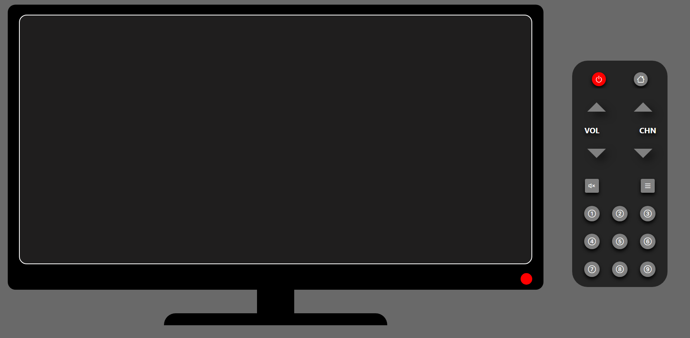
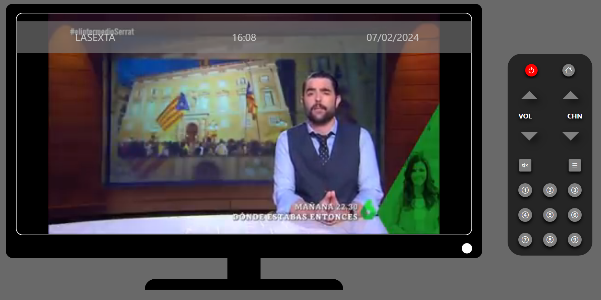

<h1 align="center">
   
  
   
  TeleVisionary
   
</h1>

<h4 align="center">Sample TV website to enjoy your channels.</h4>

  <a href="#key-features">Key Features</a> •
  <a href="#project-objective">Project objective</a> •
  <a href="#demo">Demo</a> •
  <a href="#stack">Stack</a> •
  <a href="#future-improvements">Future improvements</a> •
  <a href="#view">View</a> •
  <a href="#support">Support</a> •
  <a href="#you-may-also-like">You may also like...</a>

## Key Features

* Remote controller to interact with a virtual television
* Usage of DOM to change properties of the HTML elements
* GitHub controlled develop with dedicated branches
* Multiple checks for not allowing the user to break the TV interactions

## Project objective

This website is a project focused on the JavaScript control around the DOM and the multiple possibilities that you can do around it, focused on the creation of a TV where you can watch your favourite channels, with an interactive remote controller to change the TV content and configuration.

## Demo

You can try the [demo](https://cariblagit.github.io/TeleVisionary/) the latest version of TeleVisionary for your explorer.

## Stack

 

## Future improvements

⬜ Getting the signal from actual real channels to set it into the content
 
⬜ Guide menu for knowing the channels info and content
 
✅ Making the website full responsive for all devices
 
⬜ Adding more channels and controlling the multiple number button input

## View

<h4>Initial interface</h4>

<h4>TV on and working showing the channel and actual data</h4>

## Support

## You may also like...

- [Between Sins](https://gitlab.com/daghdha1/betweensins) - RPG videogame 
- [Mars Alienated](https://gitlab.com/AdrianGarciaAndreu/mars-alienated-rv-htc) - VR escape room experience in a space station

